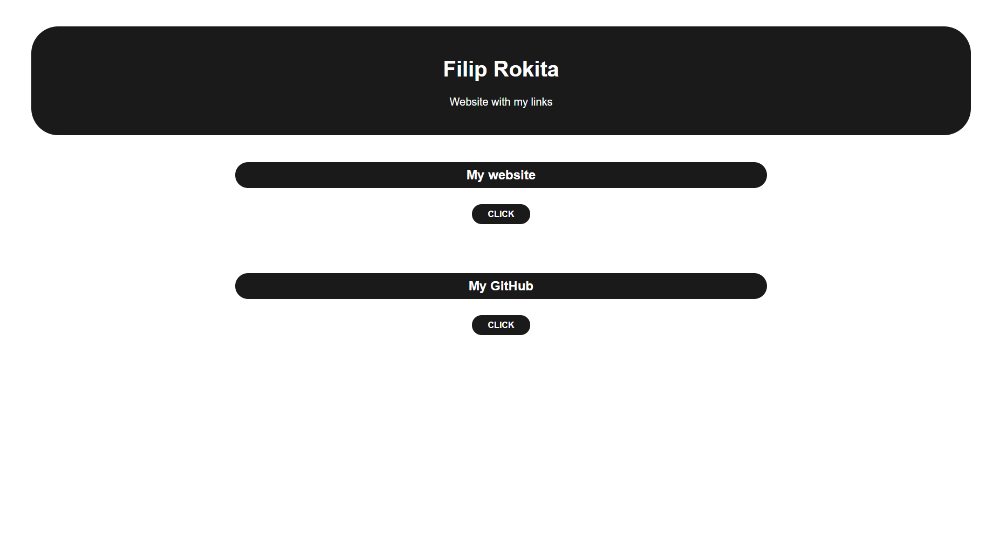

# LINKPAGE
A tool that creates a link page for you! All you have to do is enter in a simple console script what your website should look like and what links you want to display. This means that you can create your own website without any knowledge. It is very useful for social media character limits. 
 

# Why would I want to use it?
In today's world, almost all of us use social media. We all know the limitations of BIO or tweets and sometimes we want to share far more links than we are allowed to. This is where LINKPAGE comes in handy!

# How do I use it?
1. Put the ``LINKPAGE.py`` in the directory you want your website to be.
2. Run the script
3. If you are using it for the first time, select that you want to create new link page configuration. (if you had used it in the past, you can also load configuration from ``settings.py`` file)
4. Input your name
5. Input description of your link page
6. Input color you want your font to be e.g. red, black, #ffffff, #1a1a1a
7. Input color you want your item background (header, links and buttons background) to be
8. Input color you want your website background to be
9. If you are using LINKPAGE for the first time, select that you want to create new links (if you had used it in the past, you can also load existing links from links.py file)
10. Input number of links you want your site to display
11. For every link, input the link title and the url
12. Your page will be generated in the folder where ``LINKPAGE.py`` is

# Author
Filip Rokita 
www.filiprokita.com
